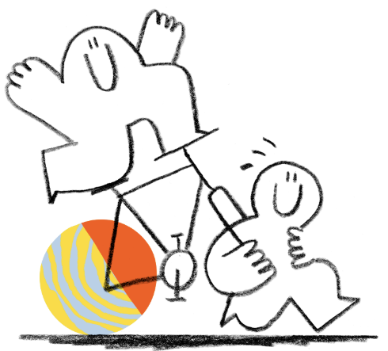

# Raster-Image-to-Graph-Converter-v1.1
A program where it converts an image into a Desmos graph

! 

## What's Improved
- Reduced the equation output
- Bezier Fitting
- Resampling and Smoothening 

## Usage
- Clone this repo and open `skanny.py`
- Paste your image path
- When done, go to `graph_skanny.txt` and copy everything
- Paste it into Desmos, zoom out to the top right (where x and y are positive) to see the image

It'll take some time for Desmos to load, if it's been a loading for a suspicious amount (~20sec average but depends on the resolution and image size) of time then it's likely that it's too much for Desmos to load. In that case, turn on blur when prompted when some details can be spared or resize to reduce the size of the graph. Both will reduce the amount of equations either way.

To debug, turn on debug when prompted. It shows the result of the images after going through cv2 functions. It also shows the total runtime to resample, smooth and fit the curves in beziers. 

## Techstack
- OpenCV
- Numpy

## Architecture

Image Path --> Turn it into binary (black/white) --> Optional Blur/Resize --> Goes through Canny Edge detection algorithm --> SKeletonize Canny Output into Paths --> Resample Path Pixel Coordinates (to ensure equal distance between pixels) --> Smoothen Paths with Savgol filter --> Fit Paths into Beziers --> Bezier Optimazation --> Parametrization in equations

## Previous V1
https://github.com/cziwu12/Raster-Image-to-Equation-Converter

## License

This project is licensed under the MIT License

I also used the `fitCurves` repo by Volker Poplawski for the Scheider Bezier Fitting Algorithm (Tho I did changed some stuff in `fitCurves.py` and `bezier.py`) FitCurves Repo: https://github.com/volkerp/fitCurves